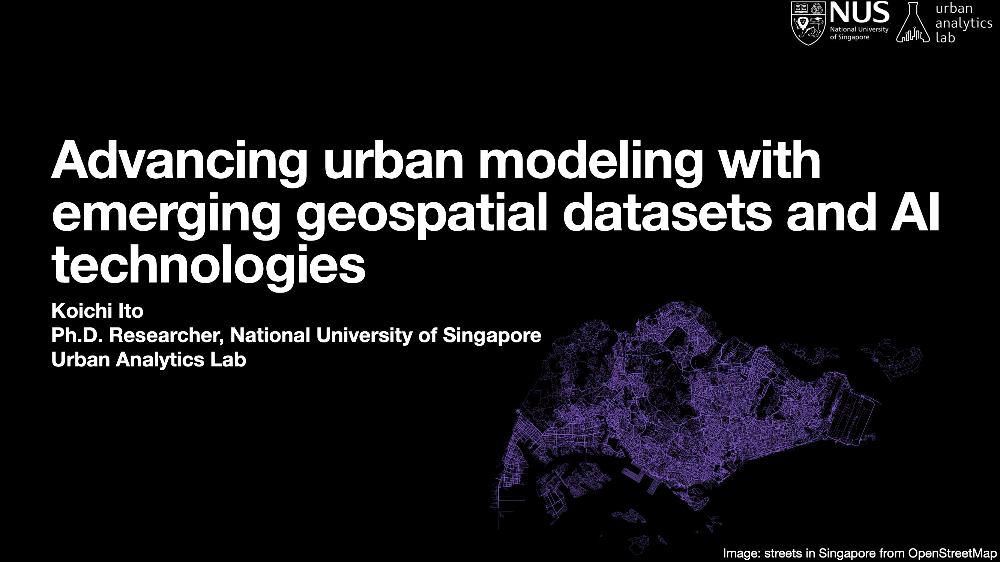

# Abstract:
Street view imagery has been increasingly popular in urban analytics field. I shared some use cases of time-series street view imagery and discussed potential benefits of leveraging this emergent data set. 

# Slides' Thumbnail

