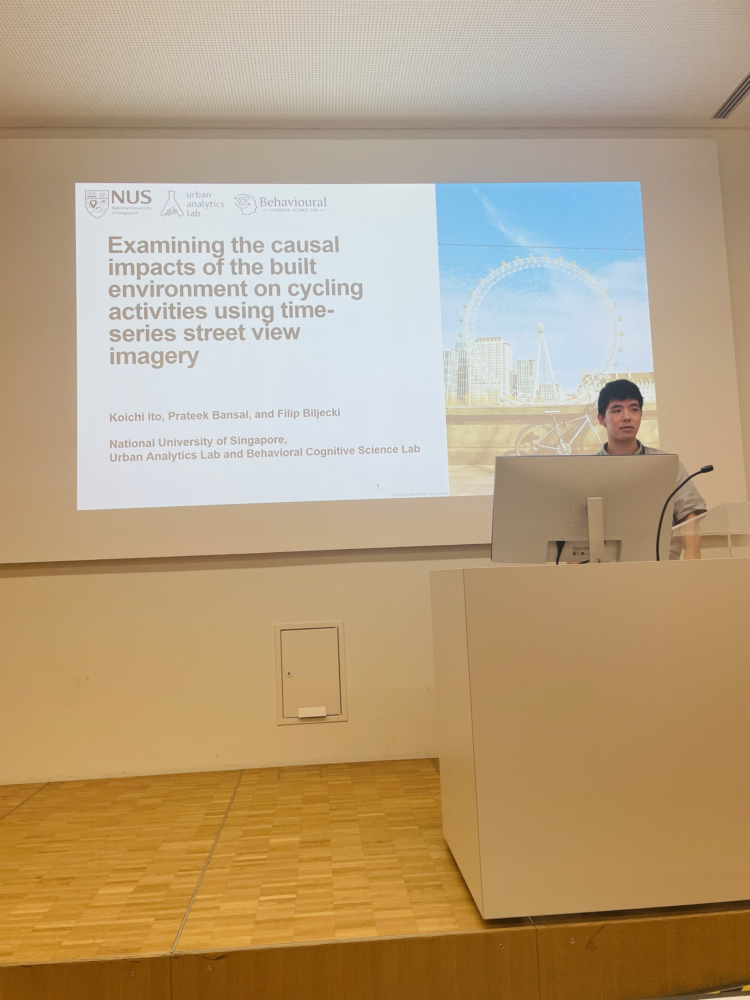

# Abstract:
Street view imagery has been increasingly popular in active mobility research. I discussed how we can use causal models to estimate the effects of visual elements on cyclist count in London.

# My Presentation

