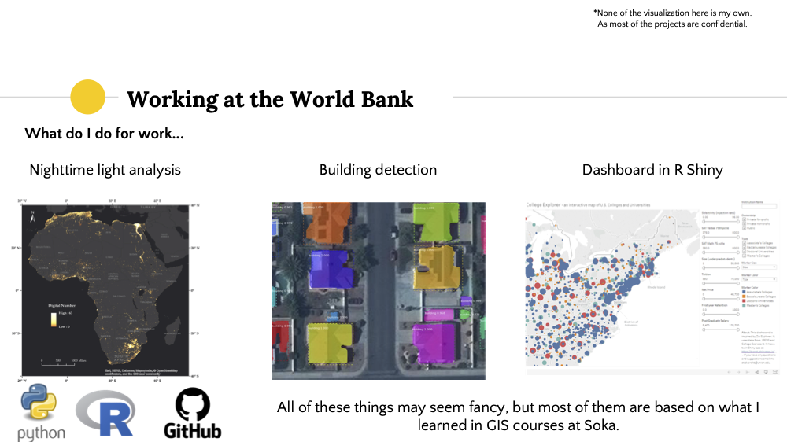

# Background 
As I was looking for an opportunity to share my research activities with people in the field, a GIS professor at my undergraduate university offered me to give an online talk at her GIS course. 

# Content

The outline of the talk was as following:
1. My master’s program
2. Research on street view imagery: literature
review
3. Research on street view imagery: bikeability
4. Work at the World Bank
5. Q&A

