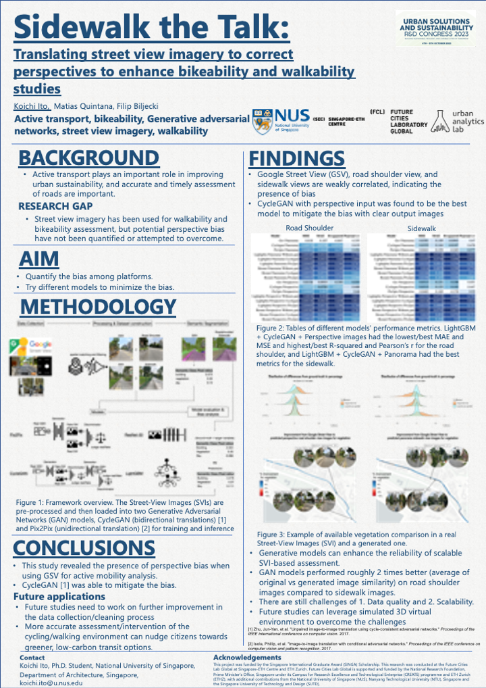

# Abstract:
The recent surge in the utilization of street view imagery (SVI) and deep learning technologies has catalyzed numerous studies evaluating active transportation infrastructure on a large scale. However, a significant limitation is that conventional SVI is captured from vehicles, which diverges from cyclists' and pedestrians’ perceptions. Research has not yet quantified these biases nor suggested any methodologies for adjusting for these differences. We introduced mean intersection over the union of semantic segmentation as a partial loss function and utilized perspective images as input to better study these biases. Such a methodological enhancement provides a more accurate representation and understanding of the biases. Furthermore, we compared the effectiveness of  Generative Adversarial Networks (GAN) models using Pix2Pix and CycleGAN architectures in correcting for these biases. CycleGAN offers a more general approach by supporting unpaired image datasets and allows bidirectional translations (from dataset A to B and vice versa), whereas Pix2Pix necessitates more curated paired-image datasets and permits only unidirectional translation (from dataset A to B). Our results reveal notable biases when comparing conventional SVI to cyclists’ perspectives (R2: -0.84-0.10), and both CycleGAN and Pix2Pix models alone were able to reduce such biases (R2: -0.26-0.17). Moreover, the combination of CycleGAN model outputs and the LightGBM model demonstrated promise in diminishing these biases (R2: 0.55-0.69). As SVI ascends to mainstream prominence in evaluating the active transport and urban environment, this study provides an approach that rectifies perspective biases of pedestrians and cyclists,  ensuring a balance of scalability and enhanced reliability in SVI analysis. This advancement paves the way for cost-effective active transport infrastructure assessments to recommend timely and precise urban planning policies that can amplify walkability and bikeability, thus nudging citizens towards greener, low-carbon transit options. 

# Poster

